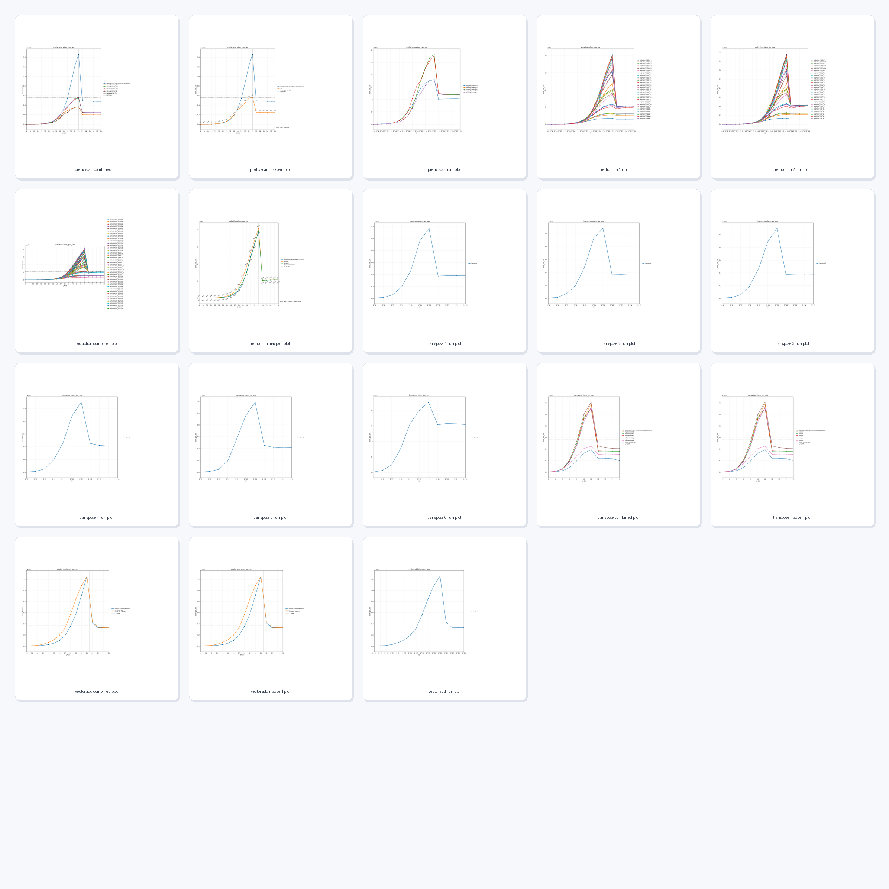
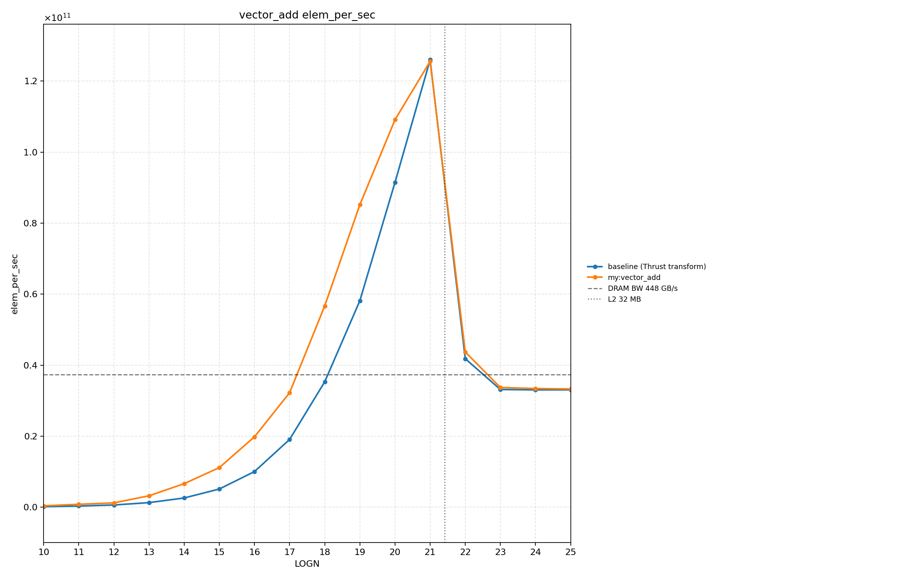
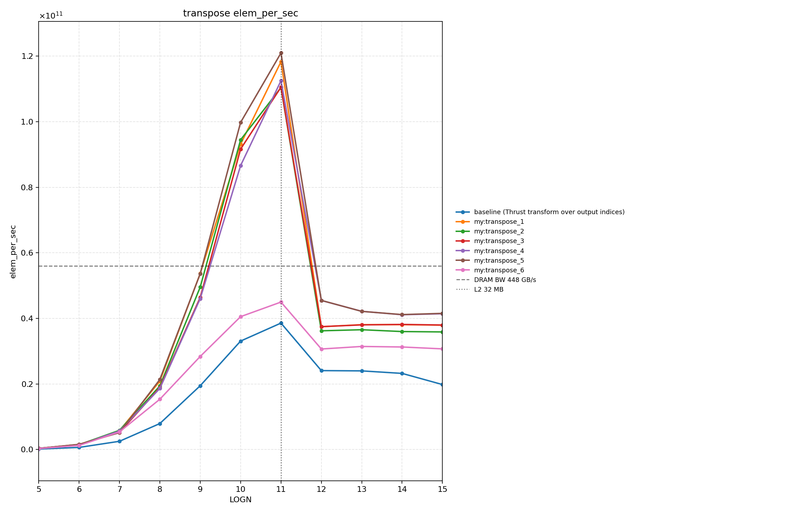
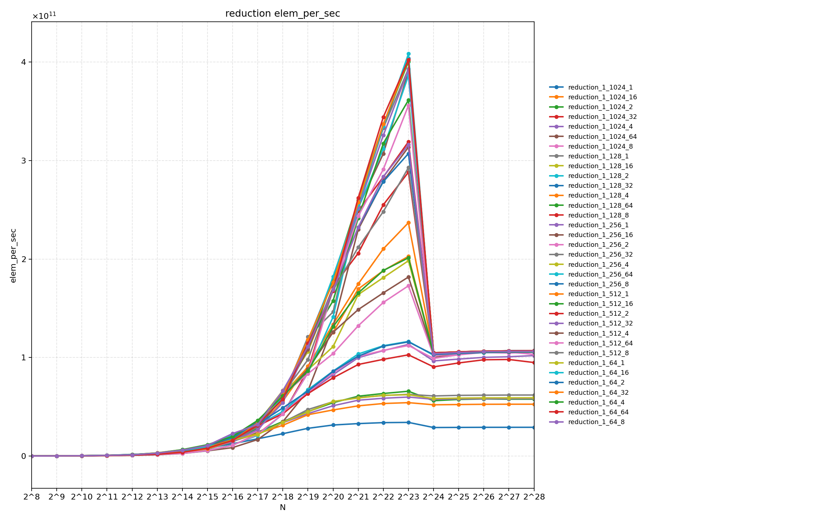
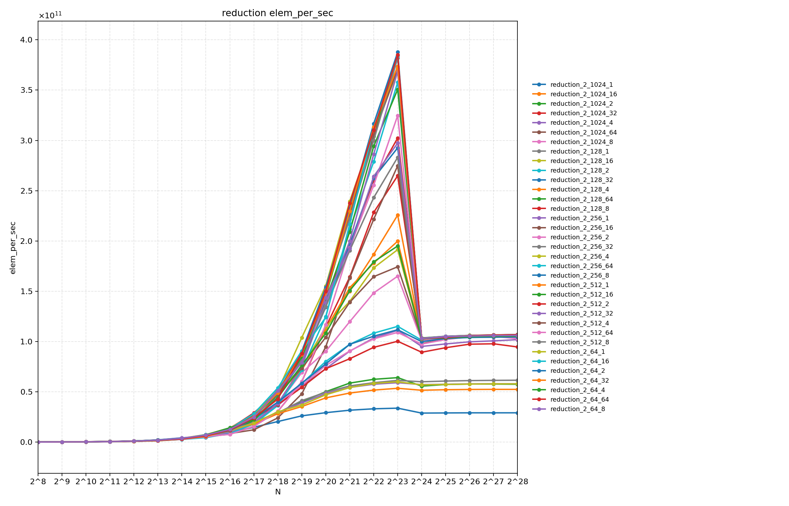
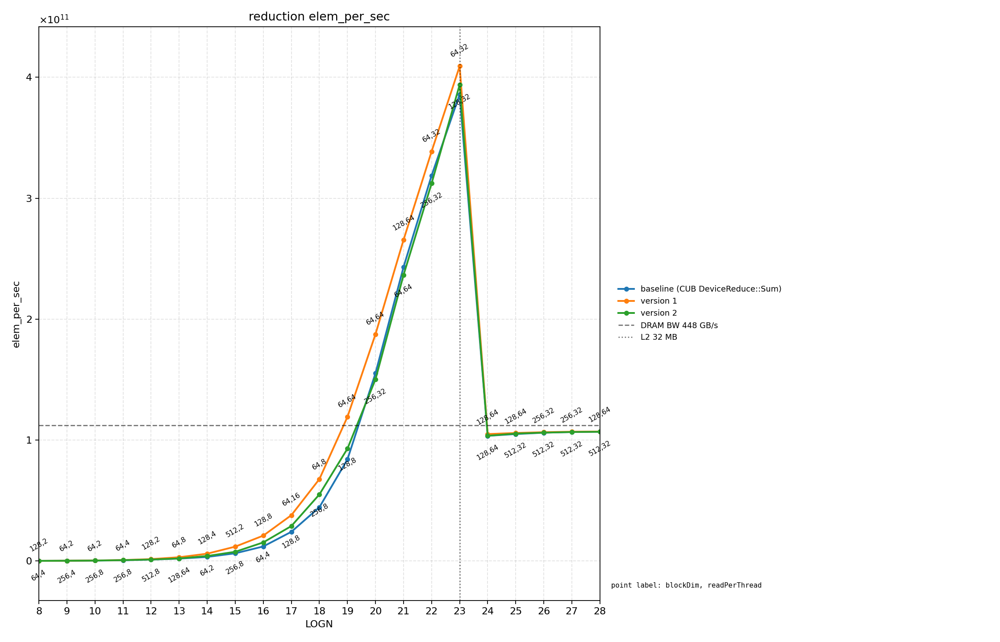
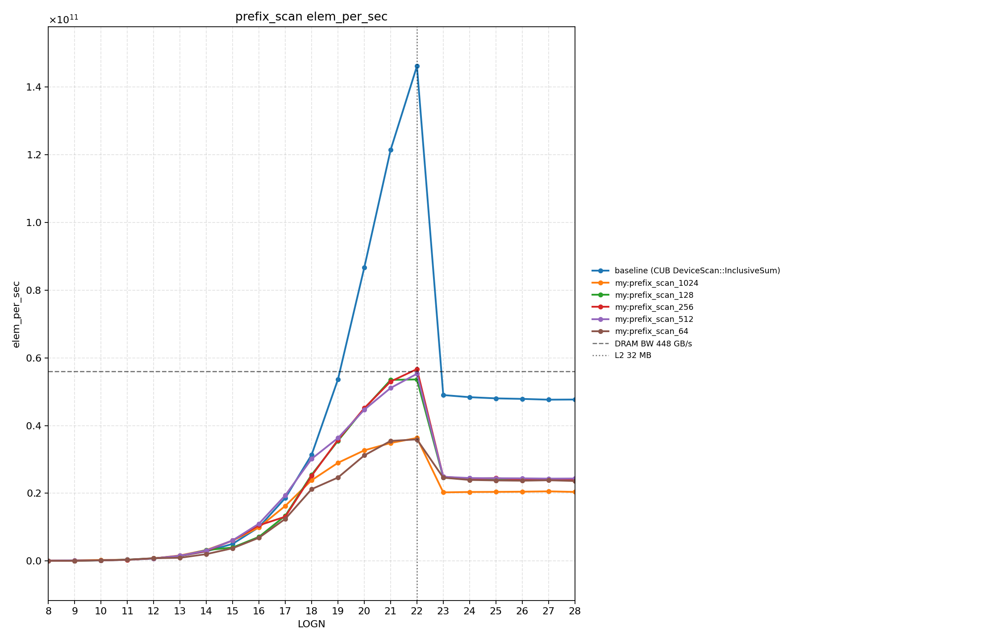

# CUDA Kernel Optimization

## 1. Introduction

This project optimizes CUDA kernels.

| Kernel | Best Large-size Throughput | Bandwidth Estimate | % of Bandwidth Ceiling | Main Bottleneck |
|---|---:|---:|---:|---|
| Vector Add | ~33 GElem/s | ~396 GB/s | ~88.3% | DRAM bandwidth |
| Matrix Transpose | ~40 GElem/s | ~320 GB/s | ~71.4% | access pattern / occupancy |
| Reduction | ~107 GElem/s | ~428 GB/s | ~95.5% | DRAM bandwidth |
| Prefix Scan | ~24.3 GElem/s | ~388.8 GB/s | ~86.7% | multi-pass global memory traffic |



workflow:
- implement baseline and tuned variants
- run size sweeps
- summarize the best-performing configuration at each size
- plot performance trends
- inspect representative kernels with Nsight Compute

Current kernel families:
- vector add
- matrix transpose
- reduction
- prefix scan

<br>


## 2. Results

### a. Vector Add `(88.3% of peak)`



- Reached about `123 GElem/s` at small working set size.
- With `12 B/elem` traffic (`2` reads + `1` write), that corresponds to about `1476 GB/s`, which is explained by cache residency.
- After the working set moved beyond cache-friendly size, throughput dropped to about `33 GElem/s`, or about `396 GB/s`.
- Using the measured GPU bandwidth assumption in the notes (`448 GB/s` theoretical), the large-size plateau is about `88%` of peak DRAM bandwidth.

Main takeaway:
- vector add behaves as an almost pure memory-bandwidth probe, and the large-size plateau is close to the DRAM roofline.

### b. Matrix Transpose `(71.4% of peak)`



- Naive transpose reached about `116 GElem/s` at smaller footprint and dropped to about `38 GElem/s` at larger footprint.
- Shared-memory and bank-conflict variants were compared across several implementations.
- The best large-size behavior in the notes is around `40 GElem/s`, or about `320 GB/s`.
- The experiments suggest shared memory helps more once the footprint exceeds the GPU L2 cache, while small problems are dominated by cache effects and synchronization overhead.
- A `32x32` thread-block version performed poorly because it pushes occupancy too low on the tested GPU.

Main takeaway:
- transpose is strongly shaped by access pattern, cache size, and occupancy; shared memory is not automatically a win unless it fixes a real memory-access problem.

### c. Reduction `(95.5% of peak)`

<p align="center">
  
  
</p>
<br>

summerized by max performance:



- Early reduction experiments plateaued around `54 GElem/s`, then a launch-count bug and a validation issue were fixed.
- After the fix, the best large-size throughput reached about `107 GElem/s`, which is about `428 GB/s`.
- Using the same `448 GB/s` theoretical reference from the notes, that is about `95.5%` of peak DRAM bandwidth.
- Increasing `read_per_thread` helped significantly after the fix because it improved the memory-access pattern.
- `blockDim=1024` performed badly, while `128`, `256`, and `512` were much healthier.
- Completing the full reduction to one output element did not materially reduce the large-size plateau.

Main takeaway:
- the reduction kernels are already very close to the memory-bandwidth roofline on large inputs, and the important tuning variables were read-per-thread and occupancy, not maximum block size.

### d. Prefix Scan `(86.7% of peak)`



- Implemented warp-level, block-level, and global multi-kernel prefix scan.
- Peak performance appeared near the L2-sized region, with a plateau around `24.3 GElem/s` on larger sizes.
- Based on the notes, this corresponds to about `388.8 GB/s`, or about `86.7%` of DRAM bandwidth for the current multi-pass design.
- The current implementation is fundamentally limited by extra global memory traffic from the multi-kernel structure.

Main takeaway:
- the current two-pass style scan is already efficient, but further gains likely require reducing global-memory traffic rather than small local tuning only.

## 3. How To Use

### a. Build

Build all kernel binaries:
```bash
make
```

Remove all built kernel binaries:
```bash
make clean
```

### b. Run

Run all configured custom-kernel sweeps:
```bash
make run-all
```

Run all configured NVIDIA-library baseline sweeps:
```bash
make run-baseline-all
```

Run one kernel family's custom sweep or NVIDIA baseline:
```bash
make run-softmax
make run-baseline-softmax
```

Run only the original four optimized kernels, including their baselines, summaries, and plots:
```bash
make vector_add transpose reduction prefix_scan \
     run-vector_add run-baseline-vector_add \
     run-transpose run-baseline-transpose \
     run-reduction run-baseline-reduction \
     run-prefix_scan run-baseline-prefix_scan \
     summarize-all plot-all
```

Inside an individual kernel directory, executable mode is selected by the optional third argument:
```bash
./bin/softmax_1_128 1048576
./bin/softmax_1_128 1048576 baseline
```

Normal runs write `impl=my`; baseline runs write `impl=baseline`. Baseline result files are named like:

```text
kernels/softmax/results/softmax_baseline_run.txt
```

Custom runs sweep all configured versions and tuning parameters. Baseline runs are independent of that sweep by default: each kernel family runs one representative baseline target across all configured input sizes. For example, matrix transpose custom runs write versioned files such as `transpose_1_run.txt` through `transpose_6_run.txt`, while baseline runs write one `transpose_baseline_run.txt`.

Current baseline libraries:

| Kernel | Baseline |
|---|---|
| vector add | Thrust `transform` |
| matrix transpose | Thrust `transform` over output indices |
| reduction | CUB `DeviceReduce::Sum` |
| prefix scan | CUB `DeviceScan::InclusiveSum` |
| histogram | CUB `DeviceHistogram` |
| stream compaction | CUB `DeviceSelect::If` |
| radix sort | CUB `DeviceRadixSort` |
| SpMV | cuSPARSE `cusparseSpMV` |
| softmax, layernorm, fused ops, top-k, convolution 2D, gather/scatter | Thrust |

Remove all saved run output files:
```bash
make clean-run-all
```

Run the full build-run-summarize-plot pipeline:
```bash
make pipeline-all
```

Run the same pipeline for one kernel family:
```bash
make pipeline-softmax
```

For the current naive kernels, per-kernel pipeline runs are usually more practical than `pipeline-all` because naive sort/top-k style kernels are intentionally slow at large sizes.

### c. Summarize Results

Summarize one run file into a sibling `_maxperf.txt` file that keeps only the highest-performance line for each `N`:
```bash
./scripts/summarize_maxperf.sh kernels/reduction/results/reduction_1_run.txt
```
This writes `kernels/reduction/results/reduction_1_run_maxperf.txt`

Summarize all run files under `./kernels/*/results/*_run.txt`:
```bash
make summarize-all
```

### d. Plot Results

Plot one raw run file into `./plots/`:
```bash
./scripts/plot_elem_per_sec.py kernels/reduction/results/reduction_1_run.txt
```
This writes `plots/reduction_1_run_plot.png`

Plot multiple raw run files together in one combined figure:
```bash
./scripts/plot_elem_per_sec.py \
  kernels/softmax/results/softmax_1_run.txt \
  kernels/softmax/results/softmax_baseline_run.txt
```
This writes a combined plot under `plots/`.

Plot all available run files grouped by kernel family:
```bash
make plot-all
```

### e. Profile

Run Nsight Compute for one built kernel binary:

```bash
./scripts/nsite.sh kernels/reduction/bin/reduction_1_128_32 8388608
```
